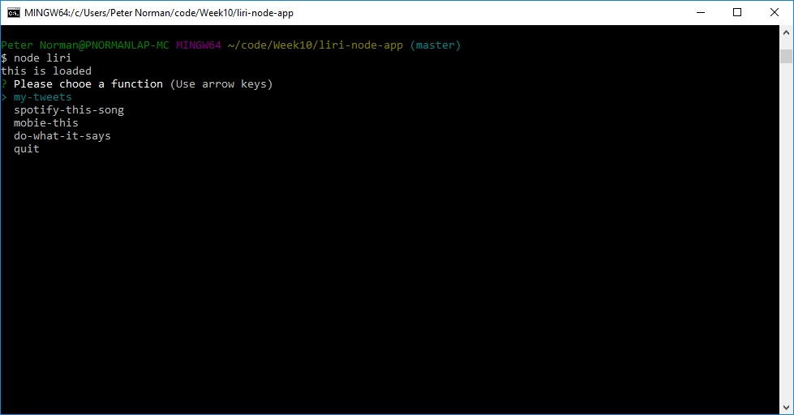
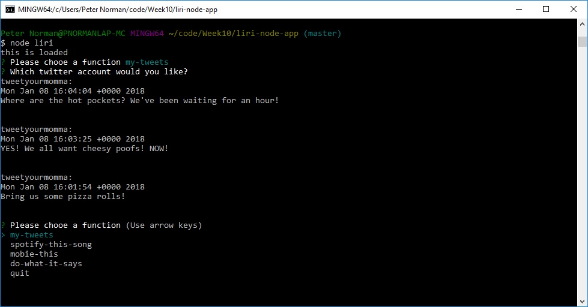
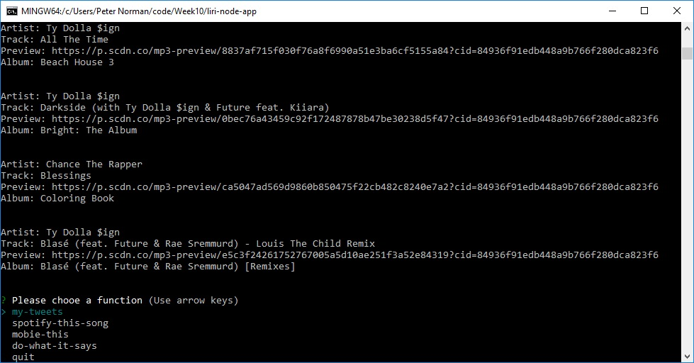
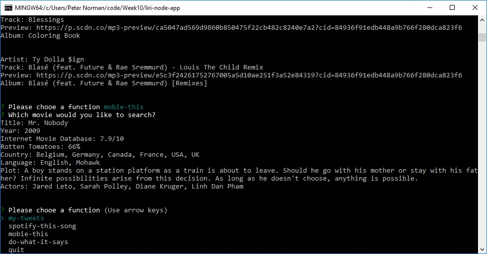

-----------------------------------------
# liri-node-app
Language_ Interpretation and Recognition Interface


#### January 2018 


-----------------------------------------

Current Version 1.0

---

LIRI is a command line node app that takes in parameters and gives you back data.

liri.js can take in one of the following commands:

    * `my-tweets`

    * `spotify-this-song`

    * `movie-this`

    * `do-what-it-says`

---

## Screenshots

<table>
    <tr>
        <td>
            
        </td>
        <td>
            
        </td>
        <td>
            
        </td>
        <td>
            
        </td>
    </tr>
</table>

## How you can help

* Please let us know if you find any errors or if you have ways to achieve better efficiency.

## More Project Details

### What Each Command Should Do

1. `node liri.js my-tweets`

   * This shows your last 20 tweets and when they were created at in your terminal/bash window.

   * If no account is provided then your program will default to @tweetyourmomma.

2. `node liri.js spotify-this-song '<song name here>'`

   * This will shows the following information about the song in your terminal/bash window
     
     * Artist(s)
     
     * The song's name
     
     * A preview link of the song from Spotify
     
     * The album that the song is from

   * If no song is provided then your program will default to "The Sign" by Ace of Base.

3. `node liri.js movie-this '<movie name here>'`

   * This outputs the following information to your terminal/bash window:

     ```
       * Title of the movie.
       * Year the movie came out.
       * IMDB Rating of the movie.
       * Rotten Tomatoes Rating of the movie.
       * Country where the movie was produced.
       * Language of the movie.
       * Plot of the movie.
       * Actors in the movie.
     ```

   * If the user doesn't type a movie in, the program will output data for the movie 'Mr. Nobody.'

4. `node liri.js do-what-it-says`
   
   * LIRI will take the text inside of random.txt and then use it to call one of LIRI's commands.
     
     * It should run `spotify-this-song` for "I Want it That Way," as follows the text in `random.txt`.
     
     * Feel free to change the text in that document to test out the feature for other commands.

5. `Logging Function`

* Liri will also output the data to a .txt file called `log.txt`.

- - -


## Dependencies
    
    "dotenv": "^4.0.0"
    "inquirer": "^5.0.0"   
    "node-spotify-api": "^1.0.7"
    "request": "^2.83.0"
    "twitter": "^1.7.1"

## History

This project was created for a homework assignment on 1/11/2018 for the University of Richmond Programming Bootcamp.

## License

This project is in the public domain within the United States, and
copyright and related rights in the work worldwide are waived through
the [CC0 1.0 Universal public domain dedication](https://creativecommons.org/publicdomain/zero/1.0/).
